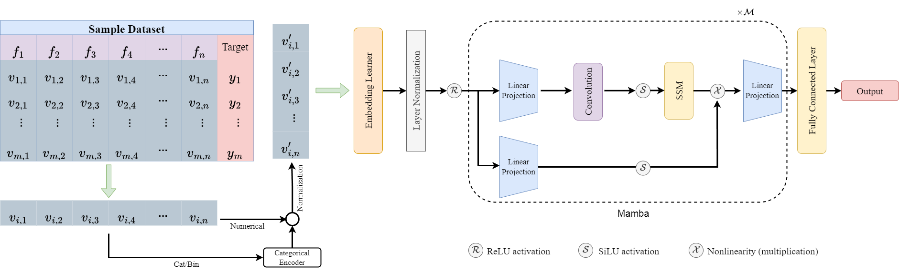
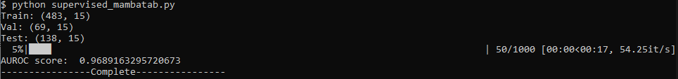

# Welcome to the repository of [MambaTab](https://arxiv.org/abs/2401.08867)

## Instructions on How to Run the Code
The following instructions will guide you through the setup and running processes of our code.
## Installation
`pip install torch==2.1.1 torchvision==0.16.1`<br>
`pip install causal-conv1d==1.1.1`<br>
`pip install mamba-ssm`<br>
## File Instructions and Brief Definitions
- `config.py`: Contains settings for training configurations.
- `MambaTab.py`: Contains the method-related code of MambaTab.
- `supervised_mambatab.py`: Code for vanilla supervised learning settings.
- `feature_incremental.py`: Code related to incremental feature settings.
- `train_val.py`: Manages the training and validation processes over epochs.
- `utility.py`: Includes functionality for data reading and preprocessing.
- Currently, our code is applicable for binary classification scenarios as all the datasets referenced in the paper involve binary classification tasks.
## Data Download and Processing
Data can be downloaded using the links provided in the paper. Please ensure the following format rules are met:

- The dataset should be in .csv format.
- The header row should be the first row in the .csv file.
- The target column should be the last column in the .csv file.
- Rename the file to data_processed.csv and place it in the datasets/X folder, where `X` can be `dress`, `cylinder`, etc.

## Configurations
Use the `config.py` file to set the necessary parameters for running the code. Additional model-related configurations can be modified in the MambaTab.py file.

## Running Specific Files
- `Vanilla Supervised Learning:` Execute `supervised_mambatab.py`. Ensure you modify the `config.py` according to your needs as per the comments provided in the code. For example for `credit approval (CA)` dataset, one example run is given below:
- 
- `Feature Incremental Learning:` Run `feature_incremental.py`.<br>
Feel free to adjust parameters and explore different configurations to achieve the best results.
## Citation

If you find this repo useful in your research, please consider citing our paper as follows:

```
@inproceedings{mambatab,
  title={MambaTab: A Plug-and-Play Model for Learning Tabular Data},
  author={Ahamed, Md Atik and Cheng, Qiang},
  booktitle={2024 IEEE Conference on Multimedia Information Processing and Retrieval (MIPR)},
  year={2024},
  organization={IEEE}
}
```
